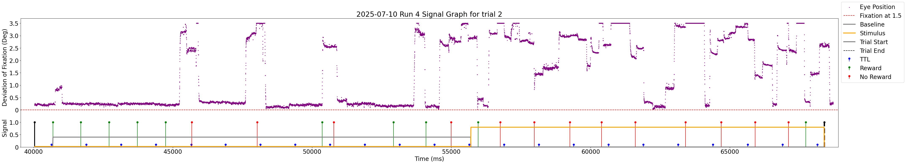
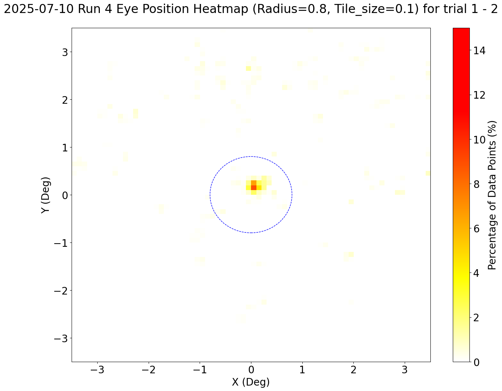
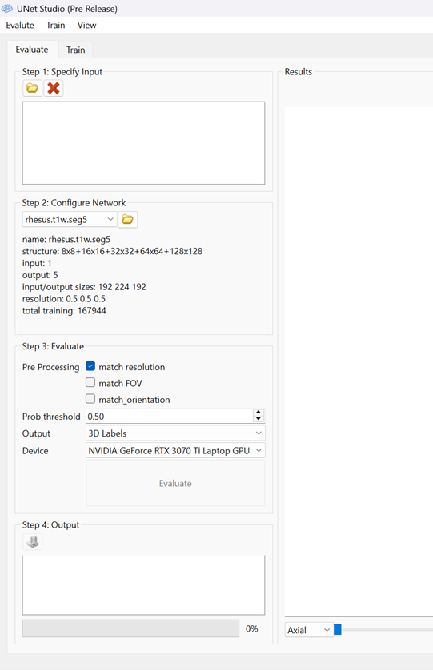

# Functional MRI Pipeline

This is the documentation of functional MRI pipeline for monkeys in Dr. Shmuel's lab at McGill Neuroscience. 

## Description

Please follow the instruction carefully. 

## Getting Started

### System

* I'm using Windows 11 with Ubuntu 24.04 sub system (WSL), thus some software are installed on Windows. All software used 
in the pipeline are available on all major systems (macOS, Linux). 
* If you are using Windows, you do need a Linux WSL. Tutorial is available in the Tools section. 

### Tools

* AFNI: https://afni.nimh.nih.gov/pub/dist/doc/htmldoc/background_install/install_instructs/index.html
  * AFNI has a complete tutorial about setting up WSL. https://afni.nimh.nih.gov/pub/dist/doc/htmldoc/background_install/install_instructs/steps_windows10.html
  * Please follow the instruction carefully and make sure that AFNI is working properly on your computer!
  * Learning AFNI can be really tricky as there are over 200 parameters for you to test. I recommend watching the AFNI 
  training videos (https://youtube.com/playlist?list=PLyGKBDfnk-iA3VYkWb8EMdsFxqtZF5JLm&si=Oa5hzrkSZZ7uaZQ) to get a head start. 
  * For AFNI GUI, I recommand going through their official website (https://afni.nimh.nih.gov/pub/dist/doc/htmldoc/afniandafni/main_toc.html). 
  In this documentation, I only demonstrate how to show fMRI analysis using AFNI. 
* FSL: https://fsl.fmrib.ox.ac.uk/fsl/docs/#/install/index
* MatLab: https://www.mathworks.com/help/install/ug/install-products-with-internet-connection.html
  * An additional package called MonkeyLogic is need. Link: https://monkeylogic.nimh.nih.gov/
* Python3: https://www.python.org/downloads/

### Directory Tree

Here is my directory tree for FMRI Project on WSL. It is important to create the correct folders and put the files correctly.

```
FMRI Project/
├── scripts/
│   ├── script-xxxx-run-all.tcsh
│   ├── script-xxxx-FH.tcsh
│   ├── script-xxxx-HF.tcsh
│   └── ...
├── python-scripts/ (if you decide to run them on WSL)
│   ├── .venv/
│   ├── plot_graphs.py
│   └── ...
├── FMRI-ANALYSIS/
│   ├── sessXXXX/
│      ├── anat/
│         ├── sess-xxxx-anat.nii.gz/
│         ├── sess-xxxx-anat-ss.nii.gz/
│         └── ...
│      ├── func/
│         ├── timing/
│            ├── xxxx.1D
│            └── ...
│         ├── skull-strip/
│            ├── ss.bash
│            └── ss-run-all.bash
│         ├── sess-xxxx-run-xxxx.nii.gz/
│         ├── sess-xxxx-run-xxxx-ss.nii.gz/
│         └── ...
```

### Data

There are two types of data, one being bhv files and another one being fMRI data files. 

* bhv files contain experimental parameters and actions, which are used for plotting graphs and generating 1D timing files. 
To obtain the bhv files, email whoever did the experiment. 
* fMRI data files are MRI images, which we mainly process. To obtain the data files, follow the steps below. 
  1. You need to have a <u>bic.mni.mcgill.ca</u> account. If you don’t have it, ask lab members or Amir. 
  2. Open your terminal and login using ```ssh username@login.bic.mni.mcgill.ca```
  3. Look for the data using ```find_mri date``` where date looks like this "20250708". It will return the path to the 
  data folder. There are two data folders. 
  4. Once the data is found, you need to claim the data by using ```find_mri -claim /data/dicom/minc/pip_XXXXX``` and 
  ```find_mri -claim /data/dicom/pip_XXXXX```. 
  5. Use Filezilla or WinSCP to download the data from BIC server. 
  6. Currently, the data in dicom folder is in dcm type. We need to change them into nii files. The command is ```dcm2niix 
  -z n -f %p_%t_%s -o output/path/to/dcm2nii input/path/to/dicom```. 
  7. Now we need to identify which nii files are MRI data files. I do this by elimination. 
     1. All fMRI data should start with "fmri_". 
     2. If a nii file ends with "_ph", it is not the correct file. 
     2. Open .json file using notepad and look for "ImageComments". If it says "Single-band reference", then it's not 
     what we want. 
     3. Check the size of the nii file. If it only has a few MB, then it is not the correct file. 
  8. Identify the structural image. Normally it starts with "t2_space". 
  9. Move all fMRI data to "func" folder. Move the structural image to "anat" folder. See directory tree above. 

## Pipeline

### <u>MatLab</u>

All Matlab files are located in ./matlab-scripts GitHub folder. If you are using Windows, I recommend running MatLab on 
Windows, not WSL. Here I assume that you have already installed MonkeyLogic to MatLab. 

I recommend reading through the code before running them. There are lots of inline comments so it is not difficult to 
understand the code. 

### downstream.m

The only useful function is "combineMonkeyLogicCodes" that takes the bhv file as input, and it creates a csv file 
including all signals timestamps. The function "plot_graphs_for_current_trial" is deprecated as its feature has
been moved to Python. This csv file is needed for plotting the signal graphs (explained later).

### plotEyepos.m

The only useful function is "write_eyepos_to_csv" that takes the bhv file as input, and it creates a csv file that 
contains x and y coordinates and magnitude of each trial. The function "plot_heatmap" is deprecated as its feature has 
been moved to Python. This csv file is needed for plotting the heatmap graphs (explained later).

### generateTimingFilesGoodBlocks.m

The function "generateTimingFilesGoodBlocks" takes several parameters, one of which is Pip_Performance file (included). 
You need to some modifications to the file. Please check previous sheets. The function outputs a 1D file for that run. 
This file is needed in the fMRI analysis. Please put all 1D files into func/timing folder (see directory tree). 

### <u>Python</u>

All python files are located in ./python-scripts GitHub folder. It is up to you if you want to run it on WSL or your own 
system. 

### Set up Virtual Environment
Virtual Environment is beneficial because you can install packages locally, for this project. If you use IDEs like PyCharm, 
there's a virtual environment already setup (.venv). Otherwise, you have to create the virtual environment yourself. 
In case you don't know how, here are the steps. 
1. ```python3 -m venv .venv```
2. To activate: ```source .venv/bin/activate```
3. To deactivate: ```deactivate```

### Install necessary packages

Install the necessary packages. There is a requirement.txt in the project. You can install all the packages at once by 
typing ```pip install -r requirements.txt```

### plot_graphs.py

plot_graphs.py is used to generate graphs. I suggest reading through the code briefly to get a general idea of what’s 
going on. There are lots of comments and instructions to help you understand. You don’t have to understand every piece 
of code, unless the requirements have been changed and you need to do modifications. 

Currently, the requirement is to generate a signal graph that has everything in it, which means it includes start & end, 
stimulus & baseline, reward & no reward, eye position of the monkey, etc. However, if you want to have individual graphs, 
there are such methods like plot_discrete_graph for you to use. The issue is that they are outdated and not guaranteed 
to work properly. 

To run this: ```python plot_graphs.py```

The following is an example of a signal graph. We can see from the graph that the fluctuations of eye position are 
closely related to the reward and non-reward signals. 


The following is an example of a heatmap graph. We can see from the graph that during trial 1 and 2, the monkey did 
concentrate at the center of the fixation radius, yet occasionally it looked above the fixation circle. 


### eyepos-threshold-checker.py

eyepos-threshold-checker.py is used to create an outlier 1D binary file based on the eye position. It has two methods, 
mean and percentage. For mean, specify the mean threshold and standard deviation threshold. If the data is less than both 
thresholds, 1 is written, otherwise 0. For percentage, you specify a percentage threshold and the fixation. The script 
calculates the percentage of good rate (data entries that are less than the fixation). If the rate is higher than the 
threshold, 1 is written, otherwise 0. 

To run this: ```python eyepos-threshold-checker.py```

### <u>Skull Stripping</u>

Here we discuss how to do skull stripping on MRI data. There are two types of data, functional and anatomical (structural). 
They are treated differently. 

### Functional data

1. Put functional data inside "skull-strip" folder. 
2. The main skull stripping algorithm is in ss.bash. It takes two arguments: input file name, and output file name (-ss). 
   1. Split the functional by frames using fslsplit
   2. Use FSL BET to do skull stripping frame by frame. Here I use the default parameters. You can tweek them if needed. 
   BET doc: https://web.mit.edu/fsl_v5.0.10/fsl/doc/wiki/BET(2f)UserGuide.html
   3. Merge the skull stripped frames into one file using fslmerge
3. You can use ss-run-all.bash to run process all the functional files automatically. 

### Structural data

There are several ways to do skull stripping on structural image, depending on which structural image. 

Method 1: UNet-Studio (good for T1 space)

* Link: https://unet-studio.labsolver.org/
* Download: https://unet-studio.labsolver.org/download.html

The UI looks like this. 



1. Specify input. Straight forward. 
2. Configure network. Please use rhesus (not human, not rat). If you don’t have rhesus, ask!
3. Evaluate. Check all three pre-processing steps. For the output, select “Skull Strip”. For the device, select CPU or GPU. 
4. Hit Evaluate button and wait! 

Method 2: 3dSkullStrip from AFNI (good for T2 space)

* Doc: https://afni.nimh.nih.gov/pub/dist/doc/program_help/3dSkullStrip.html
* Usage ```3dSkullStrip -input structural.nii.gz -prefix structural-ss.nii.gz -orig_vol -monkey``` 
* Useful parameters: 
  * -shrink_fac Parameter controlling the brain vs non-brain intensity threshold (tb). Default is 0.6, increase it to 
  get more trimmed. 
  * -niter Number of iterations. Default is 250. Mine used 600.
  * -touchup Perform touchup operations at end to include areas not covered by surface expansion.
  * And more… Please read the doc!

### <u>Executing pipeline</u>

In the "pipeline-scripts" GitHub folder, move all files to "scripts" folder under "FMRI project". Read through the scripts 
carefully. 


### <u>Software Usage</u>

### AFNI

Go to your "FMRI-ANALYSIS.results" folder and type ```afni```. 

1. Change underlay to structural image, and overlay to stats image.
2. You will see another section of the panel appears and the brain images are colorful.
3. Move your cursor to p. q values, click and hold right mouse button. A small panel will appear. Select "Set p=0.001".
4. Click Clusterize. In the menu, set the NN level to 1. The number of voxels depends on the data. You can try some numbers. 
5. You can toggle the "pos" button to see only the active activations. 


### FSLeyes

Go to your "FMRI-ANALYSIS.results" folder and type ```fsleyes```. FSLeyes only supports nii files. 
Therefore, you cannot directly open the afni files in FMRI-ANALYSIS.results. You can convert them using ```AFNItoNIFTI 
XXXX.FMRI-ANALYSIS+orig.``` command. 


## Author

Charles Liu

Email: <u>peiyong.liu@mail.mcgill.ca</u>

## License

This project is licensed under the [NAME HERE] License - see the LICENSE.md file for details

## Acknowledgments

Inspiration, code snippets, etc.
* [awesome-readme](https://github.com/matiassingers/awesome-readme)
* [PurpleBooth](https://gist.github.com/PurpleBooth/109311bb0361f32d87a2)
* [dbader](https://github.com/dbader/readme-template)
* [zenorocha](https://gist.github.com/zenorocha/4526327)
* [fvcproductions](https://gist.github.com/fvcproductions/1bfc2d4aecb01a834b46)
